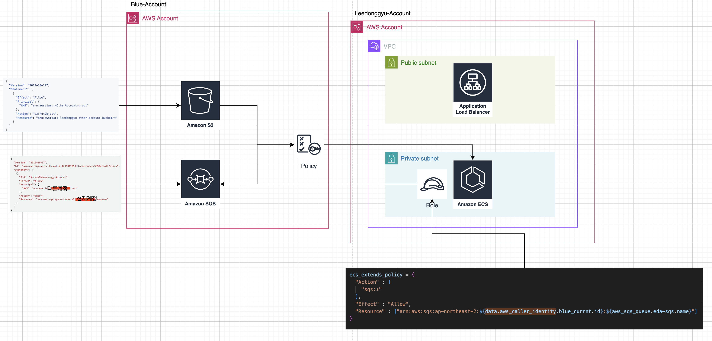
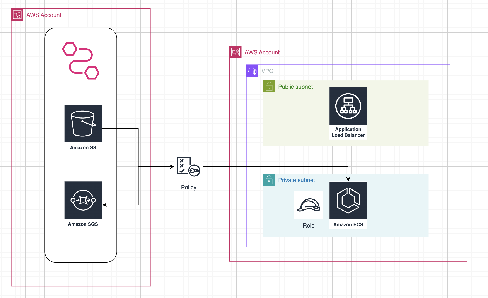

# EDA-Architecture

## Cross Account SQS Architecture



### 실행방법

```sh
  cd infra
  terraform init && terraform apply

  cd ..
  make push
```

- S3, SQS 내에서는 사용계정의 AWS Account을 허용해야 함 (사진참조)
- 사용계정의 ECS 정책에 S3, SQS를 보유하고있는 계정의 Resource를 허용해야 함 (사진참조)
- SSM 정책 추가 해야 함 + SSM 업데이트 후 재배포 해야 함

## Cross Account EventBridge Pipe Architecture


