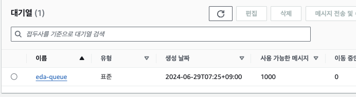
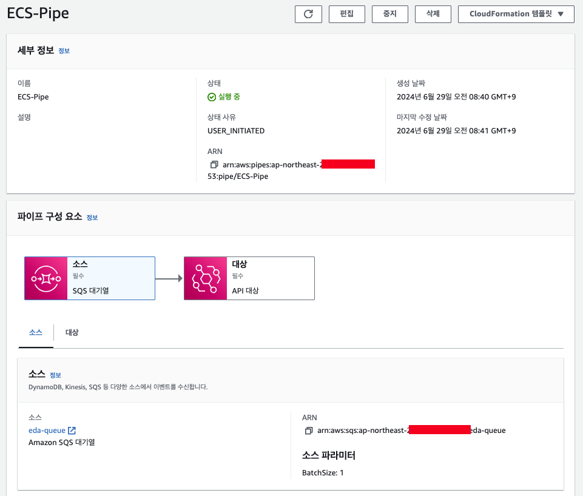

# EDA-Architecture

## Cross Account SQS Architecture


### 실행방법

```sh
  cd infra
  terraform init && terraform apply

  cd ..
  make push
```

- S3, SQS 내에서는 사용계정의 AWS Account을 허용해야 함 (사진참조)
- 사용계정의 ECS 정책에 S3, SQS를 보유하고있는 계정의 Resource를 허용해야 함 (사진참조)
- SSM 정책 추가 해야 함 + SSM 업데이트 후 재배포 해야 함

### Enqueue / Dequeue



```
  make enq
  make deq
```

## Cross Account EventBridge Pipe Architecture




- EventBridge Pipe 설정하기 위해서는 Target 등록을 해야 함 ( ACM + HTTPS )
- Pipe는 Terraform으로 안했음

## 결론

- 실시간성은 떨어진다 (Kinesis로 대체...)
- 챌린지 성격이 강한 HTTP, TCP 통신보다는 Event Driven 하게 동작하는게 더 좋을 수 있을것같다
- 모든 Queue를 Kafka로 해도 좋을듯 함